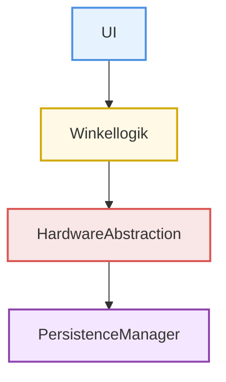

# Architektur

## Festlegen des Architekturmusters

Wie in der Retrospektive aus Sprint 2 zu sehen, bleibt die Architektur größtenteils identisch, einige Schnittstellen wurden aber geändert.

### Schichtenarchitektur:

### Bezug der Komponenten:

UI                  -> Winkellogik:         Weitergabe von Userinputs

Winkellogik         -> HardwareAbstraction: Ansteuerung der Mechanik

HardwareAbstraction -> PersistenceManager:  Log Events

### Zuordnung Requirements:

| Komponente | Requirement | Tracking |
| --- | --- | --- |
| UI | F2.1, F3.1, F3.2, F3.3, F3.4, NF3.1, NF3.2, NF3.3 | CTR-4, CTR-5, CTR-6, CTR-10, CTR-11, CTR-19, CTR-20, CTR-21 |
| Winkellogik | F1.3, F2.2, F4.1, F4.2, F5.1, F5.2, NF2.1, NF4.1 | CTR-3, CTR-9, CTR-7, CTR-8, CTR-12, CTR-13, CTR-14, CTR-15 |
| HardwareAbstraction | F1.1, F1.2, F5.3, NF1.1, NF1.2 | CTR-1, CTR-2, CTR-16, CTR-17, CTR-18 |
| PersistenceManager | NF5.1 | CTR-22 |

### Aufgaben der Komponenten:

| Komponente | Rolle | Aufgaben |
| --- | --- | --- |
| UI | Präsentationschicht | Zustandsanzeige, Nutzereingabe |
| Winkellogik | Domänenschicht | Winkelsteuerung |
| HardwareAbstraction | Hardware-Interface | Sensoren |
| PersistenceManager | Speicherschicht | Limits, Inaktivitätszeit |

### Schnittstellen:

| Quelle | Ziel | Schnittstelle |
| --- | --- | --- |
| UI | Winkellogik | sendTargetAngle(), updateDisplay() |
| Winkellogik | HardwareAbstraction | moveToAngle(), readAngle() |
| Winkellogik | PersistenceManager | loadConfig(), logEvent() |

Synchron:  sendTargetAngle(), moveToAngle(), readAngle(), loadConfig()

Asynchron: updateDisplay(), logEvent()

### Technologiestack:

| Kategorie | Technologie | Begründung |
| --- | --- | --- |
| Sprache | C++ | Erfahrung, hardwarenahes Programmieren |
| VCS | Git + Github | Standard |
| Tracking | Jira | Erfahrungen sammeln |
| IDE | CLion | Erfahrung |
| Dokumentation | Markdown | simpel, agil |

