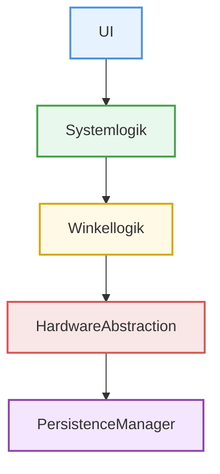

# Architektur

## Festlegen des Architekturmusters

### Schichtenarchitektur:

### Aufgaben der Komponenten:

| Komonente | Rolle | Aufgaben |
| --- | --- | --- |
| UI | Präsentationschicht | Zustandsanzeige, Nutzereingabe |
| Systemlogik | Anwendungsschicht | Systemverhalten |
| Winkellogik | Domänenschicht | Winkelsteuerung |
| HardwareAbstraction | Hardware-Interface | Sensoren |
| PersistenceManager | Speicherschicht | Kalibrierung, Limits |

